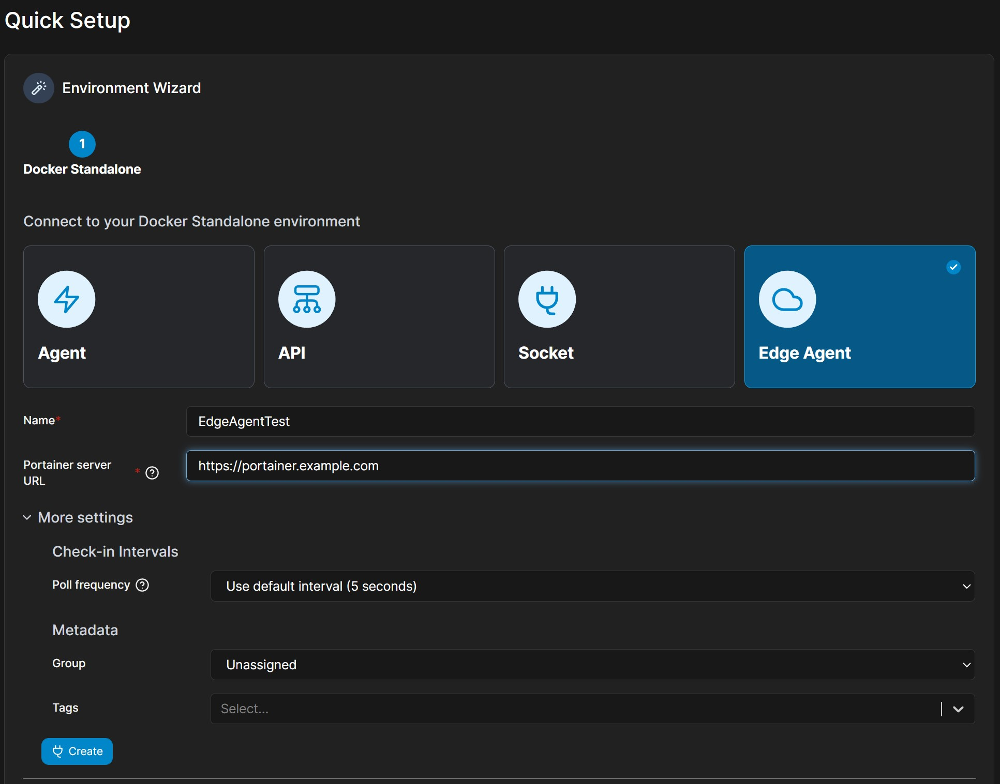

# PortainerのEgdeAgent TunnelをTraefikでリバースプロキシする

Portainer ServerをTraefik Reverse Proxy経由で公開しているとき、Egde AgentからServerに接続する方法

## Traefik

設定の一例

- docker-compose.yml

    ```yaml
    version: '3'

    services:
      reverse-proxy:
        image: traefik:v2.9
        command:
          - --api.insecure=true 
          - --providers.docker=true
          - --providers.docker.exposedbydefault=false
          - --providers.docker.network=web

          - --entrypoints.web.address=:80
          - --entrypoints.websecure.address=:443

          # - --certificatesresolvers.mytlschallenge.acme.tlschallenge=true
          # - --certificatesresolvers.mytlschallenge.acme.email=mail@example.com
          # - --certificatesresolvers.mytlschallenge.acme.storage=/letsencrypt/acme.json
        ports:
          - "80:80"
          - "443:443"
          # The Web UI (enabled by --api.insecure=true)
          - "8080:8080"
        volumes:
          # So that Traefik can listen to the Docker events
          - /var/run/docker.sock:/var/run/docker.sock
          - ./letsencrypt:/letsencrypt
        networks:
          - web

    networks:
      web:
        external: true
    ```

## Portainer Server

WebUIには `https://portainer.example.com/` でアクセス

EdgeAgentは `https://edge.portainer.example.com/`　でアクセス


- docker-compose.yml
    
    ```yaml
    version: '3'
    services:
      portainer:
        image: portainer/portainer-ce
        volumes:
          - /var/run/docker.sock:/var/run/docker.sock
          - ./data:/data
        restart: always
        labels:
          - traefik.enable=true

          # Web UI
          - traefik.http.routers.portainer.rule=Host(`portainer.example.com`)
          - traefik.http.routers.portainer.service=portainer
          - traefik.http.services.portainer.loadbalancer.server.port=9000

          # Edge Agent Tunnel
          - traefik.http.routers.portainer-edge.rule=Host(`edge.portainer.example.com`)
          - traefik.http.routers.portainer-edge.service=portainer-edge
          - traefik.http.services.portainer-edge.loadbalancer.server.port=8000
          
          # TLS設定
          - traefik.http.routers.portainer.tls.certResolver=mytlschallenge
          - traefik.http.routers.portainer-edge.tls.certResolver=mytlschallenge

        networks:
          - web

    networks:
      web:
        external: true
    ```

## Egde Agentを追加する

通常通りEdgeAgentに接続するコマンドを発行する

`Setting` -> `Environments` -> `Add environment` -> `Docker Standalone` -> `Edge Agent` を開く

Portainer Serverには `https://portainer.example.com` を設定する




Createを押すとEdgeAgentを起動するdockerコマンドが発行される

- コマンド例
    ```bash
    docker run -d \
      -v /var/run/docker.sock:/var/run/docker.sock \
      -v /var/lib/docker/volumes:/var/lib/docker/volumes \
      -v /:/host \
      -v portainer_agent_data:/data \
      --restart always \
      -e EDGE=1 \
      -e EDGE_ID=470feb4d-1cc0-42e8-a22a-e07e06635699 \
      -e EDGE_KEY=aHR0cHM6Ly9wb3J0YWluZXIuZXhhbXBsZS5jb218cG9ydGFpbmVyLmV4YW1wbGUuY29tOjgwMDB8MjM6ZjU6NmE6Njc6MGM6Njc6Mzg6NTQ6MjU6NDk6YTg6M2I6MDQ6M2I6ZmQ6ODN8Nw \
      -e EDGE_INSECURE_POLL=1 \
      --name portainer_edge_agent \
      portainer/agent:2.16.2
    ```

### EDGE_KEYを修正する

EDGE_KEYにはPortainer Serverへの接続情報がBase64形式で記載されている

形式はこのようになっている([参照](https://github.com/portainer/agent#edge-key))

```
portainer_instance_url|tunnel_server_addr|tunnel_server_fingerprint|endpoint_ID
```

上記の`EDGE_KEY`をBase64デコードすると以下のようになる

```
https://portainer.example.com|portainer.example.com:8000|23:f5:6a:67:0c:67:38:54:25:49:a8:3b:04:3b:fd:83|7
```

ここで、`tunnel_server_addr`をReverseProxyのアドレスに変更する

httpsで設定するとwssで接続される

```
https://portainer.example.com|https://edge.portainer.example.com|23:f5:6a:67:0c:67:38:54:25:49:a8:3b:04:3b:fd:83|7
```

変更した設定情報をbase64でエンコードする

```bash
$ echo "https://portainer.example.com|https://edge.portainer.example.com|23:f5:6a:67:0c:67:38:54:25:49:a8:3b:04:3b:fd:83|7" | base64 -w 0
aHR0cHM6Ly9wb3J0YWluZXIuZXhhbXBsZS5jb218aHR0cHM6Ly9lZGdlLnBvcnRhaW5lci5leGFtcGxlLmNvbXwyMzpmNTo2YTo2NzowYzo2NzozODo1NDoyNTo0OTphODozYjowNDozYjpmZDo4M3w3Cg==
```

先程のコマンドの`EDGE_KEY`を修正する

__注意：末尾の `=` パディングは不要なため取り除く__

- コマンド例(修正後)

    ```bash
    docker run -d \
      -v /var/run/docker.sock:/var/run/docker.sock \
      -v /var/lib/docker/volumes:/var/lib/docker/volumes \
      -v /:/host \
      -v portainer_agent_data:/data \
      --restart always \
      -e EDGE=1 \
      -e EDGE_ID=470feb4d-1cc0-42e8-a22a-e07e06635699 \
      -e EDGE_KEY=aHR0cHM6Ly9wb3J0YWluZXIuZXhhbXBsZS5jb218aHR0cHM6Ly9lZGdlLnBvcnRhaW5lci5leGFtcGxlLmNvbXwyMzpmNTo2YTo2NzowYzo2NzozODo1NDoyNTo0OTphODozYjowNDozYjpmZDo4M3w3Cg \
      -e EDGE_INSECURE_POLL=1 \
      --name portainer_edge_agent \
      portainer/agent:2.16.2
    ```

修正したコマンドをEdge Nodeで実行することで、EdgeAgentの接続が完了する